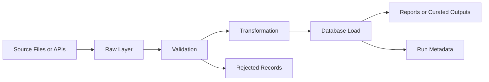

# Pipeline Overview

```mermaid
flowchart LR
    A[Source Files or APIs] --> B[Raw Layer]
    B --> C[Validation]
    C --> D[Transformation]
    D --> E[Database Load]
    E --> F[Reports or Curated Outputs]
    C --> G[Rejected Records]
    E --> H[Run Metadata]
```
